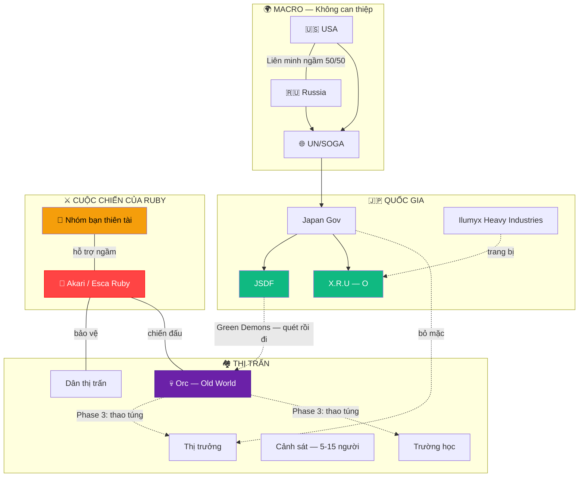
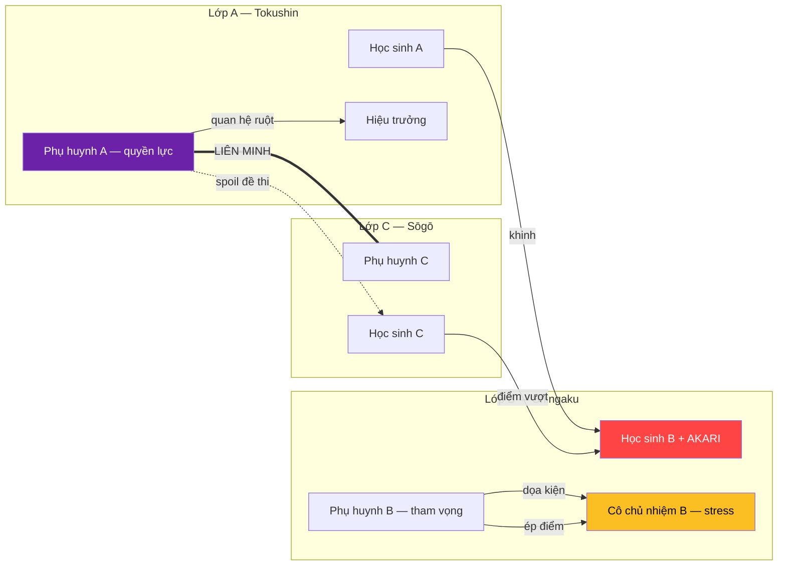
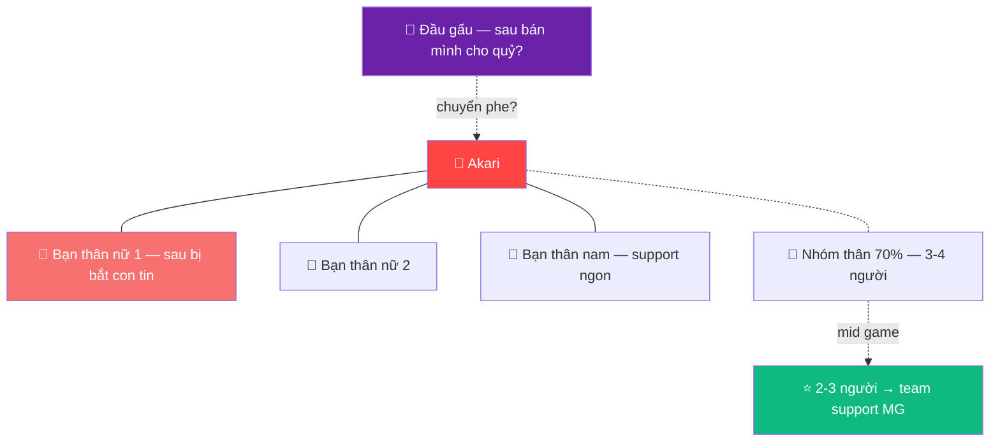

# 🕸️ RELATIONSHIP MAP

> Bản đồ quan hệ nhân vật. Edit trực tiếp, xem trên GitHub.

---

## Bàn cờ tổng thể

---

## Trường học — Monster Parent Wars

---

## Nhóm bạn Akari (chưa hoàn thiện)

---

## Cách sử dụng

- **Edit trực tiếp** trong file này — Mermaid là text thuần
- **Xem đẹp** trên GitHub (tự render diagram)
- **AI đọc được** raw text → hiểu quan hệ nhân vật
- Thêm nhân vật: copy 1 dòng, đổi tên, nối mũi tên
- `---` = quan hệ 2 chiều, `-->` = 1 chiều, `-.->` = tiềm năng/chưa chắc
